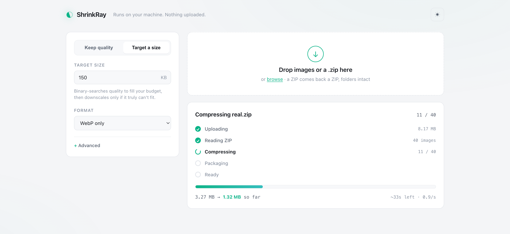

# ShrinkRay 🗜️

**A local-first image compressor you run yourself. Unlimited, free, private, open source.**

Drop in a JPEG/PNG/WebP/AVIF/TIFF/GIF — or a whole **`.zip` of them** — and get back the smallest possible AVIF, WebP, JPEG, PNG (or JXL), either **kept visually identical** or **squeezed to fit an exact KB budget**. Nothing is uploaded; every byte is processed on your machine by [sharp](https://sharp.pixelplumbing.com/) (libvips), in parallel across all your CPU cores. No accounts, no limits, no "upgrade to Pro."

It solves the three problems that make online compressors annoying:

1. **"Compress without losing quality."** ShrinkRay doesn't guess a quality number. It measures the *perceptual* difference between the original and each candidate encode ([DSSIM](#how-it-works), the metric behind JPEG XL/Guetzli) and finds the **smallest file that stays under a visible-difference threshold**. You pick the threshold in plain words ("visually lossless", "balanced"), not a magic 0–100 dial.

2. **"Make it exactly N kilobytes."** Tell it `--size 100kb` and it binary-searches the quality to *fill* that budget at the best possible quality, then downscales only if the target genuinely can't be met — and tells you honestly when it can't.

3. **"Do a whole folder at once."** Drop a **ZIP in and get a ZIP back** with the exact same folder structure, every image compressed, plus a `manifest.json` and `REPORT.txt`. Loose images can be grabbed individually or as one "Download all as ZIP." Everything runs on a [worker pool](#performance) so a batch uses every core, not one.



---

## Quick start

Requires **Node 18+**. From the project folder:

```bash
npm install          # installs sharp (image codecs) + fflate (fast ZIP)
npm start            # launches the web UI at http://127.0.0.1:4747
```

Open the URL, drag images in, download. That's it.

Prefer the terminal? The CLI is the same engine:

```bash
# Keep it visually identical, let it pick the best format
node bin/shrinkray.js hero.jpg --target visually-lossless

# Fit under 100 KB
node bin/shrinkray.js hero.jpg --size 100kb

# Batch a whole folder to WebP under 80 KB each, into out/ (runs in parallel)
node bin/shrinkray.js images/*.png --size 80kb --format webp -o out/

# A ZIP in -> a ZIP out, folder structure preserved
node bin/shrinkray.js photos.zip --target balanced

# Launch the web UI
node bin/shrinkray.js serve
```

Install it globally so `shrinkray` works from anywhere:

```bash
npm link             # then: shrinkray photo.jpg --target balanced
```

---

## The two modes

### Keep quality → smallest file

Choose a fidelity target; ShrinkRay returns the smallest file whose perceptual
difference (DSSIM) stays under that budget:

| Target | Meaning | Typical DSSIM ceiling |
|---|---|---|
| `lossless` | Bit-exact. No pixels change. | 0 |
| `visually-lossless` | You can't tell, even zoomed in. | 0.001 |
| `high` | Differences only under pixel-peeping. | 0.003 |
| `balanced` | Excellent for web. | 0.008 |
| `small` | Noticeable up close, fine in a page. | 0.02 |
| `tiny` | Thumbnails / previews. | 0.05 |

### Target a size → best quality that fits

Give a byte budget (`80kb`, `1.5mb`). ShrinkRay binary-searches quality to fill
it, and only downscales (in geometric steps) if even minimum quality overshoots.
If your target is physically unreachable, the result is flagged
`target not reached` instead of silently pretending.

Both modes work with **Auto** format (try them all, keep the smallest) or a
specific format.

---

## ZIP in, ZIP out

Drop a `.zip` (in the browser or with the CLI) and ShrinkRay:

- reads every image inside, at any nesting depth;
- compresses them all **in parallel** with your chosen mode and format;
- writes a new ZIP with the **identical folder structure**, each image at its
  original path with a new extension (`photos/hero.png` → `photos/hero.avif`);
- adds a `manifest.json` (machine-readable per-file results) and a `REPORT.txt`
  (human-readable summary);
- **never ships a file bigger than it came in** — if an already-optimised image
  would grow, the original is kept at its original path instead;
- skips non-image files (and junk like `__MACOSX/`, dotfiles) and lists what it
  skipped.

```bash
shrinkray photos.zip --target balanced            # -> photos-compressed.zip
shrinkray photos.zip --size 200kb -o out.zip      # every image under 200 KB
```

In the web UI, a dropped ZIP shows a **staged progress panel** — Uploading →
Reading → Compressing (with a live count, running size saved, and an ETA) →
Packaging → Ready — then a **Download ZIP** button. A batch of loose images gets
**Download all as ZIP** as well as individual downloads.

### Big archives (hundreds of MB to multiple GB)

Large ZIPs are handled without ever holding the archive in memory:

- the upload **streams straight to a temp file** on disk as it arrives (the
  browser shows a real upload-progress bar via `XHR.upload`, because a 400 MB
  upload should never look frozen);
- the archive is read **one image at a time** ([yauzl](https://www.npmjs.com/package/yauzl)),
  each is compressed on the worker pool, and the result is streamed into the
  output ZIP on disk ([yazl](https://www.npmjs.com/package/yazl));
- peak memory is bounded by `workers × one decoded image`, **not** by the size
  of the archive — a 400 MB ZIP and a 4 GB ZIP use about the same RAM;
- the finished ZIP is streamed back from disk on download.

So a 1 GB folder of photos compresses fine on an ordinary laptop. (It will take
a few minutes — that's the encoder, not the plumbing — which is exactly why the
progress panel shows a per-image count and ETA.) Set `SHRINKRAY_WORKERS=N` to
tune the pool size for your machine's RAM/cores.

---

## Performance

An earlier version compressed images one at a time on a single core. This one is
built for batches:

| Workload (8 photos, 4-core Mac) | Before | After | Speedup |
|---|---:|---:|---:|
| Auto format, "balanced" fidelity | 119 s | 28 s | **4.2×** |
| WebP, fit-100 KB | 14 s | 5.5 s | **2.6×** |
| Single photo, auto + balanced | 19 s | 9 s | **2.1×** |

The wins come from doing less work and doing it on every core at once:

- **Worker-thread pool.** The perceptual metric is CPU-bound JavaScript that
  would pin one core and serialize a batch. A pool of workers (one per core)
  compresses N images at once. sharp is pinned to one libvips thread per worker
  so N images in flight saturate N cores instead of fighting over threads.
- **Decode once, encode from raw.** The source is decoded to raw pixels a single
  time; every trial encode reads those pixels directly — no PNG re-encode/decode
  per iteration, and "Auto" decodes the original once for all formats, not once
  per format.
- **Seeded, early-exiting search.** The quality search starts from a per-target
  seed (from the codec equal-quality literature) and stops as soon as a result
  is near-optimal — ~3 encodes instead of ~8.
- **Right-sized effort.** AVIF final-encodes at libaom effort 3, which measured
  ~3× faster than effort 4 for ~3% larger files — the actual sweet spot.
- **Native everywhere it counts.** libvips (C) does the pixel work and fflate
  (fast, tiny) does the ZIP work; there's no slow pure-JS codec in the hot path.

Nothing here trades away the perceptual guarantee — the final encode is always
verified against the DSSIM ceiling.

---

## How it works

The interesting part is *"without losing quality."* Most tools just let you pick
a quality number and hope. ShrinkRay closes the loop:

1. **Decode the original** into planar CIELAB — a perceptually-uniform colour
   space where "distance" tracks what the eye notices, weighting lightness far
   above chroma (which is exactly what codecs throw away first).
2. **Encode a candidate** at some quality.
3. **Score it** with a multi-scale, DSSIM-style SSIM in CIELAB — the same family
   of metric that guides JPEG XL and Guetzli. It catches both fine ringing and
   coarse blotching, and unlike PSNR it correlates with human judgement.
4. **Binary-search** the quality knob, seeded near the answer and stopping once
   the result is near-optimal — usually 3–4 probes. Encoding is monotonic
   (higher quality means a bigger file *and* a lower DSSIM), which is what makes
   the search valid. To stay fast, the search encodes at a cheap "effort", then
   does a single final encode of the winner at full effort (higher effort only
   shrinks the file, so the perceptual guarantee still holds).

The DSSIM thresholds are honest judgement calls, calibrated on a mixed
photo/illustration/screenshot corpus. Re-tune them for your own content:

```bash
node tools/calibrate.js my-images/*.jpg --format avif
```

---

## Use it as a library

```js
import { compress, compressAuto } from 'shrinkray';
import { readFile, writeFile } from 'node:fs/promises';

const input = await readFile('hero.jpg');

// Smallest visually-identical file, best format chosen automatically
const { best } = await compressAuto(input, { mode: 'quality', target: 'visually-lossless' });
await writeFile(`hero.${best.ext}`, best.buffer);
console.log(best.label, best.size, `${Math.round((1 - best.ratio) * 100)}% smaller`);

// Or a hard size budget, specific format
const r = await compress(input, { format: 'avif', mode: 'size', targetKB: 120 });
```

Every result carries real measured numbers: `size`, `dssim`, a 0–100 `score`,
`ratio`, `width`/`height`, `targetMet`, and `grewLargerThanSource`.

---

## Formats

| Format | Notes |
|---|---|
| **AVIF** | Best compression; slowest to encode. Built into sharp. |
| **WebP** | Great balance of size, speed, and support. |
| **JPEG** | Uses mozjpeg (trellis quant) for the final pass. No alpha — flattened. |
| **PNG** | Lossless, or palette-quantised below quality 100. |
| **JPEG XL** | Optional — enabled automatically if the `cjxl` binary is on your PATH (`brew install jpeg-xl`). sharp's prebuilt libvips ships without it. |

---

## Design principles

- **Local-first.** No network calls. The server binds to `127.0.0.1` and streams
  results from memory — nothing is written to disk or sent anywhere.
- **Small, boring dependencies.** `sharp` (native image codecs), `fflate` +
  `yauzl`/`yazl` (fast, streaming ZIP). The HTTP server, upload streaming,
  worker pool, perceptual metric, and UI are all hand-written and auditable —
  no framework.
- **Memory-bounded.** Large uploads stream to disk and are processed one image
  at a time, so a 1 GB archive uses about the same RAM as a 50 MB one.
- **Honest output.** It never hands back a larger file, a missed target, or a
  guessed quality without saying so.

---

## License

[MIT](LICENSE). Do whatever you want with it.
