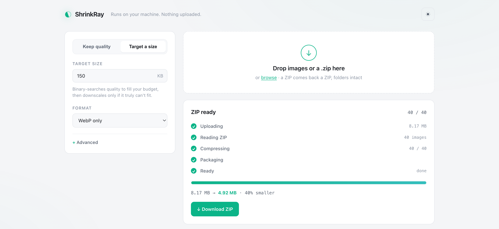

# ShrinkRay 🗜️

A local-first image compressor you run yourself. Free, private, open source, no limits.

Drop in a JPEG/PNG/WebP/AVIF/TIFF/GIF, or a whole `.zip` of them, and get back the smallest AVIF, WebP, JPEG, PNG (or JXL). You can either keep the image visually identical or make it fit an exact KB budget. Nothing is uploaded. Every byte is processed on your own machine by [sharp](https://sharp.pixelplumbing.com/) (libvips), in parallel across your CPU cores. No accounts, no limits, no "upgrade to Pro."

It covers the three things that make online compressors annoying:

1. "Compress without losing quality." ShrinkRay doesn't guess a quality number. It measures the *perceptual* difference between the original and each candidate encode ([DSSIM](#how-it-works), the metric behind JPEG XL and Guetzli) and finds the smallest file that stays under a visible-difference threshold. You pick that threshold in plain words ("visually lossless", "balanced"), not a 0-to-100 dial.

2. "Make it exactly N kilobytes." Tell it `--size 100kb` and it binary-searches the quality to fill that budget at the best quality it can, downscaling only if the target can't be met. When it can't hit the target, it says so.

3. "Do a whole folder at once." Drop a ZIP in and get a ZIP back with the same folder structure, every image compressed, plus a `manifest.json` and `REPORT.txt`. Loose images come back individually or as one "Download all as ZIP." Batches run on a [worker pool](#performance), so they use every core instead of one.


---

## Quick start

Requires Node 18+. From the project folder:

```bash
npm install          # installs sharp (image codecs) + fflate/yauzl/yazl (ZIP)
npm start            # launches the web UI at http://127.0.0.1:4747
```

Open the URL, drag images in, download.

If you prefer the terminal, the CLI runs the same engine:

```bash
# Keep it visually identical, let it pick the best format
node bin/shrinkray.js hero.jpg --target visually-lossless

# Fit under 100 KB
node bin/shrinkray.js hero.jpg --size 100kb

# Batch a whole folder to WebP under 80 KB each, into out/ (runs in parallel)
node bin/shrinkray.js images/*.png --size 80kb --format webp -o out/

# A ZIP in, a ZIP out, folder structure preserved
node bin/shrinkray.js photos.zip --target balanced

# Launch the web UI
node bin/shrinkray.js serve
```

Install it globally so `shrinkray` works from anywhere:

```bash
npm link             # then: shrinkray photo.jpg --target balanced
```

---

## The two modes

### Keep the quality, get the smallest file

Choose a fidelity target, and ShrinkRay returns the smallest file whose perceptual difference (DSSIM) stays under that budget:

| Target | Meaning | Typical DSSIM ceiling |
|---|---|---|
| `lossless` | Bit-exact. No pixels change. | 0 |
| `visually-lossless` | You can't tell, even zoomed in. | 0.001 |
| `high` | Differences only under pixel-peeping. | 0.003 |
| `balanced` | Good for web. | 0.008 |
| `small` | Noticeable up close, fine in a page. | 0.02 |
| `tiny` | Thumbnails and previews. | 0.05 |

### Target a size, get the best quality that fits

Give a byte budget (`80kb`, `1.5mb`). ShrinkRay binary-searches quality to fill it, and only downscales (in geometric steps) if even the minimum quality overshoots. If the target is physically unreachable, the result is flagged `target not reached` rather than quietly pretending.

Both modes work with Auto format (try them all, keep the smallest) or a specific format.

---

## ZIP in, ZIP out

Drop a `.zip` (in the browser or with the CLI) and ShrinkRay:

- reads every image inside, at any nesting depth;
- compresses them all in parallel, with your chosen mode and format;
- writes a new ZIP with the same folder structure, each image at its original path with a new extension (`photos/hero.png` becomes `photos/hero.avif`);
- adds a `manifest.json` (machine-readable per-file results) and a `REPORT.txt` (human-readable summary);
- keeps the original when compressing would make a file bigger, so the ZIP never contains a file larger than it started;
- skips non-image files and junk like `__MACOSX/` and dotfiles, and lists what it skipped.

```bash
shrinkray photos.zip --target balanced            # -> photos-compressed.zip
shrinkray photos.zip --size 200kb -o out.zip      # every image under 200 KB
```

In the web UI, a dropped ZIP shows a staged progress panel (Uploading, Reading, Compressing with a live count and ETA, Packaging, Ready), then a Download ZIP button. A batch of loose images gets Download all as ZIP as well as individual downloads.



### Big archives (hundreds of MB to several GB)

Large ZIPs are handled without ever holding the archive in memory:

- the ZIP is uploaded in 8 MB chunks, a few at a time, so a dropped chunk is retried on its own instead of restarting the whole upload, and the progress bar tracks real bytes stored;
- each chunk streams straight to a temp file on disk, and the archive is read one image at a time ([yauzl](https://www.npmjs.com/package/yauzl)), compressed on the worker pool, and streamed into the output ZIP on disk ([yazl](https://www.npmjs.com/package/yazl));
- peak memory is bounded by `workers × one decoded image`, not by the size of the archive, so a 400 MB ZIP and a 4 GB ZIP use about the same RAM;
- when the result is ready the download starts on its own, with a Download button as a fallback. Downloads support HTTP Range, so the browser shows progress and can resume.

A 1 GB folder of photos compresses fine on an ordinary laptop. It will take a few minutes, but that's the encoder doing the work, not the plumbing, which is why the progress panel shows a per-image count and an ETA. Set `SHRINKRAY_WORKERS=N` to tune the pool size for your machine's RAM and cores.

---

## Performance

An earlier version compressed images one at a time on a single core. This one is built for batches:

| Workload (8 photos, 4-core Mac) | Before | After | Speedup |
|---|---:|---:|---:|
| Auto format, "balanced" fidelity | 119 s | 28 s | 4.2× |
| WebP, fit-100 KB | 14 s | 5.5 s | 2.6× |
| Single photo, auto + balanced | 19 s | 9 s | 2.1× |

The gains come from doing less work and running it on every core at once:

- **Worker-thread pool.** The perceptual metric is CPU-bound JavaScript, so on one thread it pins a core and the rest of the batch waits behind it. A pool of workers, one per core, compresses several images at once. sharp is pinned to one libvips thread per worker so the images in flight fill the cores instead of fighting over threads.
- **Decode once, encode from raw.** The source is decoded to raw pixels a single time, and every trial encode reads those pixels directly. There's no PNG re-encode or re-decode per iteration, and Auto decodes the original once for all formats rather than once each.
- **Seeded search that exits early.** The quality search starts from a per-target seed (taken from the codec equal-quality tables) and stops as soon as the result is near-optimal, so it usually takes about 3 encodes instead of 8.
- **Right-sized effort.** AVIF final-encodes at libaom effort 3, which measured about 3× faster than effort 4 for roughly 3% larger files.
- **Native where it counts.** libvips (C) does the pixel work and fflate/yauzl/yazl do the ZIP work, so there's no slow pure-JS codec in the hot path.

None of these shortcuts weaken the quality guarantee: the final encode is always checked against the DSSIM ceiling.

---

## How it works

The hard part is "without losing quality." Most tools let you pick a quality number and hope. ShrinkRay closes the loop instead:

1. **Decode the original** into planar CIELAB, a colour space where distance roughly tracks what the eye notices. It weights lightness far above chroma, which is what codecs throw away first.
2. **Encode a candidate** at some quality.
3. **Score it** with a multi-scale, DSSIM-style SSIM in CIELAB, the same family of metric that guides JPEG XL and Guetzli. It catches both fine ringing and coarse blotching, and unlike PSNR it tracks human judgement.
4. **Binary-search** the quality knob, seeded near the answer and stopping once the result is near-optimal, usually in 3 to 4 probes. Encoding is monotonic (higher quality means a bigger file *and* a lower DSSIM), which is what makes the search valid. To stay fast, the search encodes at a cheap effort, then does one final encode of the winner at full effort. Higher effort only shrinks the file, so the perceptual guarantee still holds.

The DSSIM thresholds are judgement calls, calibrated on a mix of photos, illustrations, and screenshots. You can re-tune them for your own content:

```bash
node tools/calibrate.js my-images/*.jpg --format avif
```

---

## Use it as a library

```js
import { compress, compressAuto } from 'shrinkray';
import { readFile, writeFile } from 'node:fs/promises';

const input = await readFile('hero.jpg');

// Smallest visually-identical file, best format chosen automatically
const { best } = await compressAuto(input, { mode: 'quality', target: 'visually-lossless' });
await writeFile(`hero.${best.ext}`, best.buffer);
console.log(best.label, best.size, `${Math.round((1 - best.ratio) * 100)}% smaller`);

// Or a hard size budget, specific format
const r = await compress(input, { format: 'avif', mode: 'size', targetKB: 120 });
```

Every result carries measured numbers: `size`, `dssim`, a 0-to-100 `score`, `ratio`, `width`/`height`, `targetMet`, and `grewLargerThanSource`.

---

## Formats

| Format | Notes |
|---|---|
| AVIF | Best compression, slowest to encode. Built into sharp. |
| WebP | A good balance of size, speed, and support. |
| JPEG | Uses mozjpeg (trellis quant) for the final pass. No alpha, so it's flattened onto a background. |
| PNG | Lossless, or palette-quantised below quality 100. |
| JPEG XL | Optional. Turns on automatically if the `cjxl` binary is on your PATH (`brew install jpeg-xl`); sharp's prebuilt libvips ships without it. |

---

## Design principles

- **Local-first.** No network calls. The server binds to `127.0.0.1`, and nothing you compress leaves your machine. Large archives use a temp file on your own disk, which is cleaned up afterward.
- **Few dependencies.** `sharp` for the image codecs, and `fflate`/`yauzl`/`yazl` for ZIP. The HTTP server, upload streaming, worker pool, perceptual metric, and UI are all hand-written, with no framework.
- **Memory-bounded.** Large uploads stream to disk and are processed one image at a time, so a 1 GB archive uses about the same RAM as a 50 MB one.
- **Honest output.** It never hands back a larger file, a missed target, or a guessed quality without flagging it.

---

## License

[MIT](LICENSE). Do whatever you want with it.
